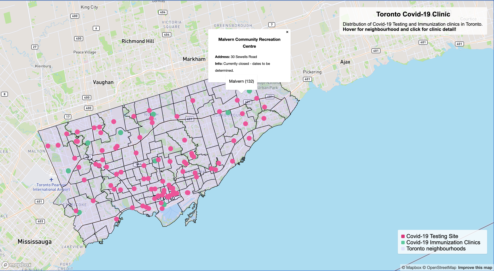

# Lab-2-Interactive-mapping: Covid-19 Testing in Toronto

## Map Excerpts [screenshot]:



## Final Map - Mapbox [interactive]:
[Full Map](472_Lab2_mapbox.html)
<iframe src="472_Lab2_mapbox.html" height = '300' width="600"></iframe>

## Final Map-Turf [interactive]:
[Full Map](472_Lab2_turf.html)
<iframe src="472_Lab2_turf.html" height = '300' width="600"></iframe>


## Reflective analysis: 

Throughout, and hopefully near the end, the Covid-19 pandemic, many testing sites have been established. As the vaccines become more widely distributed, we will hopefully see an increase in Immunization clinics! These maps hope to illustrate the distribution of testing sites and clinics in the Toronto area and help people find one in their neighbourhood. The Mapbox version shows preliminary distribution and detail of the distribution. The Turf version builds onto it and measures the closest clinic to the testing site of your choice. 

The map focused on Central Toronto because of the lack of data surrounding immunization clinics outside of Central Toronto and into the Greater Toronto Area. From the results of these maps, there are underwhelming locations for immunization clinics relative to testing sites. With expectations for more clinics soon, this map can help city and health planners to estimate the potential demand and spread out the clinics reducing the potential stress of clinics in high-demand neighbourhoods. 


Meaningful critiques and FuturevImprovements:
* Circle radius buffers, relevant to clinic distribution
  * many clinics are within an x-km radius of a testing site?
  * How many should there be
* The neighbourhood population density layer helps to visualize and estimate potential stress on clinics and testing sites
* Click-Popup in Turf sometimes 'hide' the highlighted clinic
  * have the information appear in a legend box on the edge of the map
  * include less information in the popup
  * hover instead of click? (given a try, did not produce an effect that I liked)
* Using turf.js to add travel distance and best route between locations
* Better icons and colours for easier identification
  * The hospital icon was not large enough and not brightly coloured, blends in with the background
  * The icons used for the testing site is too plain and oddly coloured, distracting from the hospital symbol


## Resources and other References:

#### Popup on hover: https://docs.mapbox.com/mapbox-gl-js/example/popup-on-hover/
```
var popup2 = new mapboxgl.Popup({
    closeButton: false
});
    map.on('mousemove', 'toronto-neighbourhoods-poly', function(e) {
        map.getCanvas().style.cursor = 'pointer';

        var feature = e.features[0];

        popup2.setLngLat(e.lngLat)
            .setText(feature.properties.AREA_NAME)
            .addTo(map);
    });
//when not hover over toronto polygon, remove popup
    map.on('mouseleave', 'toronto-neighbourhoods-poly', function() {
        map.getCanvas().style.cursor = '';
        popup2.remove();
    });
```
#### Store and use GeoJSON at URL: https://docs.mapbox.com/help/troubleshooting/working-with-large-geojson-data/

saved lots of room and confusion within the code, makes updating the file much easier too 
```
  map.addLayer({
    id: 'clinic',
    type: 'symbol',
    source: {
      type: 'geojson',
      data: 'https://raw.githubusercontent.com/fel-y/Lab-2-Interactive-mapping/main/covid-19-immunization-clinics.geojson'
          },
    layout: {
      'icon-image': 'hospital-15',
      'icon-allow-overlap': true
          },
          paint: {
          }
        });
```
#### Turf.js tutorial: https://docs.mapbox.com/help/tutorials/analysis-with-turf/

#### Maki icons for list of symbols: https://labs.mapbox.com/maki-icons/

Toronto Public Health. (2021). COVID-19 Immunization Clinics [GeoJSON]. Retrieved from https://open.toronto.ca/dataset/covid-19-immunization-clinics/

Toronto Public Health. (2021). COVID-19 Testing Sites [GeoJSON]. Retrieved from https://open.toronto.ca/dataset/covid-19-testing-sites/

City of Toronto, Social Development, Finance & Administration. (2021). Neighbourhoods [GeoJSON]. Retrieved from https://open.toronto.ca/dataset/neighbourhoods/
